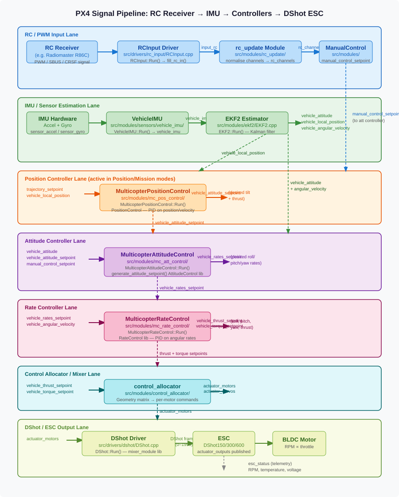

# RC / IMU to ESC Signal Pipeline

This page describes the complete signal processing pipeline that PX4 follows from the moment a pilot moves a stick on their RC transmitter to when the resulting motor commands are sent to the ESCs over DShot.
Understanding this pipeline is essential for anyone who wishes to replicate or customise the flight-control chain.

The pipeline has seven major stages:

1. RC / PWM input capture
2. IMU data acquisition and state estimation
3. Position control (active in Position and Mission modes)
4. Attitude control
5. Rate control
6. Control allocation (mixing)
7. DShot / ESC output

## Stage 1: RC / PWM Input Capture

**Goal:** Convert raw receiver signals into normalised pilot stick values published on uORB.

### Hardware connection

An RC receiver such as the Radiomaster R86C connects to the flight controller over one of the following protocols:
PPM, SBUS, DSM, CRSF, GHST, ST24, or SUMD.
The physical UART or dedicated PPM pin is handled transparently by the driver.

### Driver: `RCInput`

| Item      | Detail                                           |
| --------- | ------------------------------------------------ |
| Source    | `src/drivers/rc_input/RCInput.cpp`               |
| Class     | `RCInput`                                        |
| Scheduler | `ScheduledWorkItem` — wakes on UART RX interrupt |

**Key functions:**

- `RCInput::init()` — Opens the serial port, selects the protocol scanning state machine.
- `RCInput::Run()` — Main processing loop.
  Reads raw bytes from the UART, passes them through protocol decoders (`rc_decode_*`), and calls `fill_rc_in()` when a complete frame is received.
- `RCInput::fill_rc_in()` — Populates the `input_rc_s` struct with up to 18 raw channel values (µs widths), RSSI, and the detected protocol.
  Publishes to the `input_rc` uORB topic.
- `RCInput::set_rc_scan_state()` — Cycles through supported protocols until one is detected.

**Published topic:** `input_rc` — raw channel pulse widths (µs), up to 18 channels.

### Module: `rc_update`

| Item   | Detail                                |
| ------ | ------------------------------------- |
| Source | `src/modules/rc_update/rc_update.cpp` |

`rc_update` subscribes to `input_rc`, applies channel mappings, expo curves, and dead-bands defined by `RC_MAP_*` parameters, and publishes:

- `rc_channels` — normalised channel values in the range [–1 … +1] or [0 … 1].
- `manual_control_input` — stick axes mapped to roll/pitch/yaw/throttle.
- `manual_control_switches` — mode switches (arm, kill-switch, mode select, etc.).

### Module: `ManualControl`

`ManualControl` (in `src/modules/manual_control/`) aggregates RC and MAVLink override inputs, applies smoothing, and publishes `manual_control_setpoint` — the single topic consumed by the flight controllers.

**Published topic:** `manual_control_setpoint`

---

## Stage 2: IMU Data Acquisition and State Estimation

**Goal:** Produce a reliable estimate of vehicle attitude, position, and angular velocity from raw sensor measurements.

### IMU device drivers

Each supported IMU chip has its own driver under `src/drivers/imu/`.
Every driver publishes two raw topics at the native sensor rate (typically 1 kHz for gyroscopes, 100–500 Hz for accelerometers):

- `sensor_gyro` — raw 3-axis angular rate (rad/s), timestamp, device ID.
- `sensor_accel` — raw 3-axis linear acceleration (m/s²), timestamp, device ID.

### Module: `VehicleIMU`

| Item   | Detail                                           |
| ------ | ------------------------------------------------ |
| Source | `src/modules/sensors/vehicle_imu/VehicleIMU.cpp` |
| Class  | `VehicleIMU`                                     |

**Key functions:**

- `VehicleIMU::Start()` — Registers work-item callbacks on `sensor_gyro` and `sensor_accel`.
- `VehicleIMU::Run()` — Integrates raw samples, applies calibration (scale, offset, thermal correction), and publishes `vehicle_imu`.
- `VehicleIMU::ParametersUpdate()` — Reloads calibration coefficients from parameters whenever `parameter_update` is received.

**Published topics:**

- `vehicle_imu` — calibrated, integrated IMU data (delta angle + delta velocity).
- `vehicle_imu_status` — sensor health and sample quality.

### Module: `EKF2` (Extended Kalman Filter)

| Item   | Detail                      |
| ------ | --------------------------- |
| Source | `src/modules/ekf2/EKF2.cpp` |
| Class  | `EKF2`                      |

`EKF2::Run()` fuses `vehicle_imu`, magnetometer, barometer, GPS, and optical-flow measurements through a 24-state Extended Kalman Filter.

**Published topics:**

- `vehicle_attitude` — estimated attitude as a unit quaternion (q[0..3]).
- `vehicle_local_position` — estimated NED position (m) and velocity (m/s).
- `vehicle_angular_velocity` — gyro-rate bias-corrected angular velocity (rad/s).
- `vehicle_acceleration` — bias-corrected specific force (m/s²).

---

## Stage 3: Position Control

**Goal:** Track a desired position or velocity setpoint and compute the attitude (tilt) and collective thrust required to follow it.

This stage is bypassed in Stabilised/Acro/Manual modes; in those modes the `vehicle_attitude_setpoint` is written directly by the attitude controller from pilot stick inputs.

### Module: `MulticopterPositionControl`

| Item   | Detail                                                      |
| ------ | ----------------------------------------------------------- |
| Source | `src/modules/mc_pos_control/MulticopterPositionControl.cpp` |
| Class  | `MulticopterPositionControl`                                |
| Rate   | ≈ 50 Hz, triggered by `vehicle_local_position` updates      |

**Key functions:**

- `MulticopterPositionControl::init()` — Registers `vehicle_local_position` as the scheduling callback.
- `MulticopterPositionControl::Run()` — Retrieves the active `trajectory_setpoint` (from Navigator, offboard, or the altitude/velocity stick mapper) and calls the inner `PositionControl` library.
- `PositionControl::update()` (in `src/modules/mc_pos_control/PositionControl/PositionControl.cpp`) — Runs cascaded P / PID controllers:
  - Outer loop: position error → velocity setpoint (proportional gain `MPC_XY_P`, `MPC_Z_P`).
  - Inner loop: velocity error → thrust vector (PID gains `MPC_XY_VEL_P_ACC`, `MPC_XY_VEL_I_ACC`, `MPC_XY_VEL_D_ACC`).
- The resulting normalised thrust vector is decomposed into a tilt quaternion and a collective thrust magnitude.

**Subscribed topics:** `trajectory_setpoint`, `vehicle_local_position`, `vehicle_control_mode`, `vehicle_constraints`, `vehicle_land_detected`.

**Published topics:**

- `vehicle_attitude_setpoint` — desired attitude quaternion + collective thrust scalar.
- `vehicle_local_position_setpoint` — the setpoint actually being tracked (for logging).

---

## Stage 4: Attitude Control

**Goal:** Track the desired attitude by generating angular rate commands.

### Module: `MulticopterAttitudeControl`

| Item   | Detail                                               |
| ------ | ---------------------------------------------------- |
| Source | `src/modules/mc_att_control/mc_att_control_main.cpp` |
| Class  | `MulticopterAttitudeControl`                         |
| Rate   | ≈ 250 Hz, triggered by `vehicle_attitude` updates    |

**Key functions:**

- `MulticopterAttitudeControl::init()` — Registers `vehicle_attitude` as the scheduling callback.
- `MulticopterAttitudeControl::Run()` — Entry point for every attitude update.
  Selects the source of the attitude setpoint (position controller output or direct pilot stick commands), calls the control library, and publishes outputs.
- `generate_attitude_setpoint()` — Used in Stabilised/Manual modes only.
  Converts pilot roll/pitch sticks into a tilt quaternion and the yaw stick into a heading rate command.
- `AttitudeControl::update()` (in `src/modules/mc_att_control/AttitudeControl/AttitudeControl.cpp`) — Computes the quaternion error between the current and desired attitude and applies proportional control to produce body-frame rate commands.
  Gains are set by `setProportionalGain()` using parameters `MC_ROLL_P`, `MC_PITCH_P`, `MC_YAW_P`.

**Subscribed topics:** `vehicle_attitude`, `vehicle_attitude_setpoint`, `manual_control_setpoint`, `vehicle_control_mode`, `vehicle_status`, `vehicle_land_detected`, `hover_thrust_estimate`.

**Published topics:**

- `vehicle_rates_setpoint` — desired roll, pitch, and yaw angular rates (rad/s).

---

## Stage 5: Rate Control

**Goal:** Track the desired angular rates using high-frequency gyro feedback, generating torque and thrust setpoints.

### Module: `MulticopterRateControl`

| Item   | Detail                                                         |
| ------ | -------------------------------------------------------------- |
| Source | `src/modules/mc_rate_control/MulticopterRateControl.cpp`       |
| Class  | `MulticopterRateControl`                                       |
| Rate   | ≈ 400–1000 Hz, triggered by `vehicle_angular_velocity` updates |

**Key functions:**

- `MulticopterRateControl::Run()` — Triggered by every new gyro sample.
  Reads `vehicle_rates_setpoint` and `vehicle_angular_velocity`, computes PID errors on all three axes, and calls the `RateControl` library.
- `RateControl::update()` (in `src/lib/rate_control/RateControl.cpp`) — Core PID computation for roll, pitch, and yaw rate.
  Gains are `MC_ROLLRATE_P/I/D`, `MC_PITCHRATE_P/I/D`, `MC_YAWRATE_P/I/D`.

**Subscribed topics:** `vehicle_angular_velocity`, `vehicle_rates_setpoint`, `manual_control_setpoint` (Acro mode), `vehicle_control_mode`, `vehicle_status`.

**Published topics:**

- `vehicle_torque_setpoint` — desired torque on each body axis (Nm, normalised).
- `vehicle_thrust_setpoint` — desired collective thrust vector.

---

## Stage 6: Control Allocation (Mixing)

**Goal:** Translate abstract torque and thrust setpoints into per-motor throttle commands, accounting for airframe geometry.

### Module: `control_allocator`

| Item   | Detail                                               |
| ------ | ---------------------------------------------------- |
| Source | `src/modules/control_allocator/ControlAllocator.cpp` |
| Class  | `ControlAllocator`                                   |

`ControlAllocator::Run()` applies a pre-computed effectiveness matrix that maps the four-dimensional command vector [roll torque, pitch torque, yaw torque, collective thrust] to individual motor throttle values in the range [0 … 1].
The matrix is generated from the frame geometry configured by `CA_AIRFRAME` and the per-motor position/orientation parameters.

Motor failures detected at run-time are handled by recomputing a pseudo-inverse that excludes the failed motor.

**Subscribed topics:** `vehicle_torque_setpoint`, `vehicle_thrust_setpoint`, `failure_detector_status`.

**Published topics:**

- `actuator_motors` — normalised throttle [0 … 1] for each motor.
- `actuator_servos` — normalised position [–1 … +1] for each servo.

---

## Stage 7: DShot / ESC Output

**Goal:** Encode `actuator_motors` values as DShot digital frames and transmit them to the ESCs at the configured protocol rate.

### Driver: `DShot`

| Item    | Detail                                                   |
| ------- | -------------------------------------------------------- |
| Source  | `src/drivers/dshot/DShot.cpp`                            |
| Class   | `DShot`                                                  |
| Library | `src/lib/mixer_module/mixer_module.cpp` (`MixingOutput`) |

**Key functions:**

- `DShot::init()` — Configures the DShot timer peripheral (DShot150, DShot300, or DShot600 based on `DSHOT_CONFIG`).
  Each speed uses a different bit-clock:
  - DShot150 = 150 kbps
  - DShot300 = 300 kbps
  - DShot600 = 600 kbps
- `DShot::Run()` — Called each output cycle.
  Invokes `MixingOutput::update()` from the shared mixer-module library, which reads `actuator_motors`, applies the `DSHOT_MIN_THROTTLE` / `DSHOT_MAX_THROTTLE` limits, and passes the scaled value to the DShot bit-banger.
  The throttle integer range is 0 (disarm) to 1999 (full power).
- `DShotTelemetry` — Optional back-channel that reads RPM, temperature, voltage, and current responses from the ESC and publishes `esc_status`.

**Subscribed topics:** `actuator_motors`, `vehicle_command`, `parameter_update`.

**Published topics:**

- `actuator_outputs` — the actual integer values (0–1999) written to each DShot channel.
- `esc_status` — per-ESC telemetry (RPM, temperature, voltage, current).

---

## Complete uORB Topic Chain

The table below summarises every uORB topic in the pipeline from RC stick to motor output.

| Topic                       | Published by                         | Consumed by                         | Description                             |
| --------------------------- | ------------------------------------ | ----------------------------------- | --------------------------------------- |
| `input_rc`                  | `RCInput`                            | `rc_update`                         | Raw RC channel pulse widths             |
| `rc_channels`               | `rc_update`                          | `ManualControl`                     | Normalised channel values [–1…+1]       |
| `manual_control_setpoint`   | `ManualControl`                      | `mc_att_control`, `mc_rate_control` | Pilot stick roll/pitch/yaw/throttle     |
| `sensor_gyro`               | IMU driver                           | `VehicleIMU`                        | Raw gyroscope samples                   |
| `sensor_accel`              | IMU driver                           | `VehicleIMU`                        | Raw accelerometer samples               |
| `vehicle_imu`               | `VehicleIMU`                         | `EKF2`                              | Calibrated delta-angle + delta-velocity |
| `vehicle_attitude`          | `EKF2`                               | `mc_att_control`                    | Estimated attitude quaternion           |
| `vehicle_angular_velocity`  | `EKF2` / sensors                     | `mc_rate_control`                   | Bias-corrected gyro rate                |
| `vehicle_local_position`    | `EKF2`                               | `mc_pos_control`                    | Estimated NED position + velocity       |
| `trajectory_setpoint`       | Navigator / pilot                    | `mc_pos_control`                    | Desired position or velocity            |
| `vehicle_attitude_setpoint` | `mc_pos_control` or `mc_att_control` | `mc_att_control`                    | Desired attitude + collective thrust    |
| `vehicle_rates_setpoint`    | `mc_att_control`                     | `mc_rate_control`                   | Desired roll/pitch/yaw rates            |
| `vehicle_torque_setpoint`   | `mc_rate_control`                    | `control_allocator`                 | Desired body-frame torques              |
| `vehicle_thrust_setpoint`   | `mc_rate_control`                    | `control_allocator`                 | Desired collective thrust vector        |
| `actuator_motors`           | `control_allocator`                  | `DShot` / `PWMOut`                  | Per-motor normalised throttle           |
| `actuator_outputs`          | `DShot` / `PWMOut`                   | Logging, telemetry                  | Actual ESC command values               |
| `esc_status`                | `DShot`                              | Commander, logging                  | ESC telemetry (RPM, temp, voltage)      |

---

## Key Source Files at a Glance

| Stage                 | Source file                                                 | Main class                   | Entry-point function                |
| --------------------- | ----------------------------------------------------------- | ---------------------------- | ----------------------------------- |
| RC input              | `src/drivers/rc_input/RCInput.cpp`                          | `RCInput`                    | `RCInput::Run()`                    |
| RC update             | `src/modules/rc_update/rc_update.cpp`                       | `RCUpdate`                   | `RCUpdate::Run()`                   |
| IMU aggregation       | `src/modules/sensors/vehicle_imu/VehicleIMU.cpp`            | `VehicleIMU`                 | `VehicleIMU::Run()`                 |
| State estimation      | `src/modules/ekf2/EKF2.cpp`                                 | `EKF2`                       | `EKF2::Run()`                       |
| Position control      | `src/modules/mc_pos_control/MulticopterPositionControl.cpp` | `MulticopterPositionControl` | `MulticopterPositionControl::Run()` |
| Attitude control      | `src/modules/mc_att_control/mc_att_control_main.cpp`        | `MulticopterAttitudeControl` | `MulticopterAttitudeControl::Run()` |
| Rate control          | `src/modules/mc_rate_control/MulticopterRateControl.cpp`    | `MulticopterRateControl`     | `MulticopterRateControl::Run()`     |
| Control allocation    | `src/modules/control_allocator/ControlAllocator.cpp`        | `ControlAllocator`           | `ControlAllocator::Run()`           |
| DShot output          | `src/drivers/dshot/DShot.cpp`                               | `DShot`                      | `DShot::Run()`                      |
| Mixer module (shared) | `src/lib/mixer_module/mixer_module.cpp`                     | `MixingOutput`               | `MixingOutput::update()`            |

---

## Replicating the Pipeline

To replicate or customise a stage of this pipeline:

1. **Identify the uORB topics** your replacement module must subscribe to and publish.
   All message definitions are in `msg/`.
2. **Create a new module** following the template in `src/modules/` and the guide at `docs/en/modules/hello_sky.md`.
   Use `ModuleBase` and `ScheduledWorkItem` as base classes.
3. **Implement `Run()`** — subscribe to the input topics using `uORB::SubscriptionCallbackWorkItem` (for rate-driven execution) or `uORB::Subscription` (for polling), compute your control law, and publish outputs with `uORB::Publication`.
4. **Register the module** in its `CMakeLists.txt` and the board configuration (`boards/<vendor>/<board>/default.px4board`).
5. **Disable the original module** by removing it from the board configuration or sending a `stop` command at run-time.

Refer to the existing controller sources listed in the table above as concrete examples of this pattern.

## Related Documentation

- [PX4 Architectural Overview](../concept/architecture.md)
- [Control Allocation](../concept/control_allocation.md)
- [uORB Messaging](../middleware/uorb.md)
- [Flight Modes](../concept/flight_modes.md)
- [DShot ESCs](../peripherals/dshot.md)
- [RC Systems](../getting_started/rc_transmitter_receiver.md)
- [EKF2 Tuning Guide](../advanced_config/tuning_the_ecl_ekf.md)
